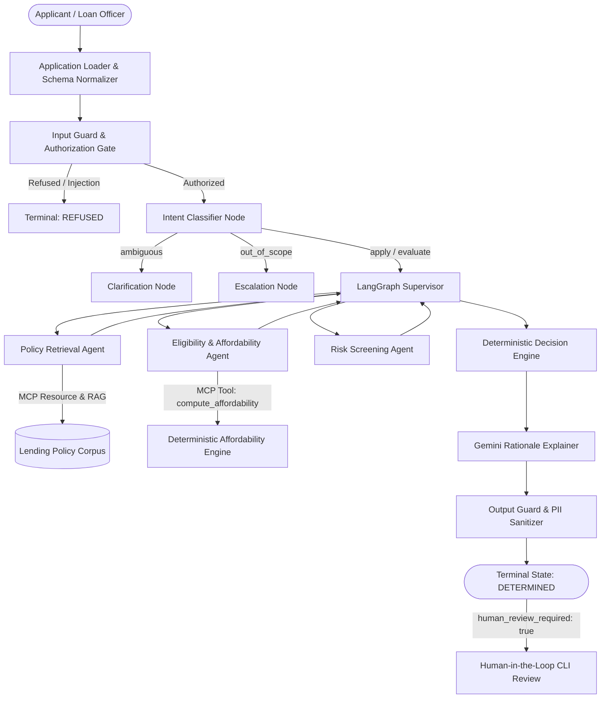

# Loan Origination & Underwriting Copilot — System Architecture

## 1. High-Level Architecture
The Loan Origination & Underwriting Copilot is built upon an observable, governed, multi-agent architecture using **LangGraph**, **Model Context Protocol (MCP)**, **Google Gemini**, and **Arize Phoenix**.

### The Core Architectural Invariant
> **Code decides, LLM explains.**  
> The Large Language Model (Google Gemini) is strictly segregated from mathematical calculations, threshold evaluations, and decision assignments. Pure Python `Decimal` arithmetic computes DTI and disposable income in [`src/domain/calculations.py`](../src/domain/calculations.py). The deterministic rule engine in [`src/domain/rules.py`](../src/domain/rules.py) evaluates thresholds. Only [`src/domain/decisions.py`](../src/domain/decisions.py) may write `state["ai_recommendation"]`. Gemini is invoked solely to draft a clear, human-readable explanatory rationale citing verified policy rules.

---

## 2. Multi-Agent Data Flow

---

## 3. Per-Node Failure Semantics Table (plan.md Section 14.17)

Every node in the LangGraph graph executes with strictly defined failure semantics, preventing silent error propagation or undefined system states:

| Node Name | Primary Responsibility | Input Preconditions | Failure Mode / Exception | Degraded Behavior & Output State |
| :--- | :--- | :--- | :--- | :--- |
| **`input_guard`** | Authorization check and prompt injection screening. | Raw input payload. | Unauthorized user or prompt injection pattern detected. | Halts execution immediately; sets `request_status = "REFUSED"`, `refusal_reason` populated; no LLM call. |
| **`intent_classifier`** | Maps request into one of 7 allowed intents. | Valid `request_status == "IN_PROGRESS"`. | LLM failure or unclassifiable intent. | Fallback intent `ambiguous`; transitions to `clarification_node` with standard clarification question. |
| **`policy_agent`** | Deterministic policy selection and chunk retrieval via MCP. | Valid application product, country, date. | No matching policy version or corpus unavailable. | Sets `decision_status = "UNABLE_TO_COMPLETE"`, `unable_reason = "POLICY_NOT_FOUND"`, `human_review_required = true`. |
| **`eligibility_agent`**| Affordability computation via MCP tool (`compute_affordability`). | Normalized income and obligation figures. | MCP timeout (>10s) or numerical computation error. | Bounded retry (max 2 attempts); on failure sets `decision_status = "UNABLE_TO_COMPLETE"`, `unable_reason = "MCP_UNAVAILABLE"`. |
| **`risk_agent`** | Evaluates risk flags and missing mandatory documentation. | Policy rules and application documents. | Corrupted document metadata. | Generates missing document flag; defaults to `REFER` for underwriting review. |
| **`decision_engine`** | Pure deterministic rule engine assigning `ai_recommendation`. | Affordability metrics, risk flags, policy rules. | Any assertion or domain rule mismatch. | Sets `decision_status = "UNABLE_TO_COMPLETE"`, flags human review. |
| **`rationale_node`** | Gemini call drafting explanatory rationale text. | Finalized deterministic recommendation. | Gemini API timeout (>20s), rate-limit, or outage. | Bounded retry; fallback to `GEMINI_FALLBACK_RATIONALE` without altering `ai_recommendation`. |
| **`output_guard`** | PII scrub and advisory language enforcement. | LLM-generated rationale. | Unmasked PII or prescriptive language detected. | Masks PII patterns via regex; appends standard advisory compliance disclaimer. |

---

## 4. Subsystem Boundaries

1. **State Management (`src/state.py`)**:
   - Explicit TypedDict with four-way state separation: `ai_recommendation` vs `final_decision` vs `decision_status` vs `request_status`.
   - Immutable invariant enforcement via `assert_state_invariants(state)`.
2. **Deterministic Domain Core (`src/domain/`)**:
   - Zero LLM dependencies.
   - Exact Python `Decimal` arithmetic for interest rates, monthly obligations, DTI ratios, and disposable income.
3. **Model Context Protocol (`mcp_server/`)**:
   - Standard FastMCP server running over stdio.
   - Exposes Tool 1 (`get_policy_document`), Tool 2 (`compute_affordability`), and Resource (`policy_corpus://index`).
4. **Context Engineering (`src/context/`)**:
   - Write/Select/Compress/Isolate/Quarantine pipeline.
   - Eliminates redundant context (>50% token reduction via heuristic filler-stripping, turn deduplication, and syntactic compaction) and isolates raw unvetted input.
5. **Observability & Unified Logging (`src/observability/`)**:
   - Dual-write logging pattern: writes to per-concern log and unifies into `logs/unified_trace.jsonl` atomically.
   - Real-time PII span sanitizer scrubs sensitive identifiers from Phoenix OpenTelemetry traces.
